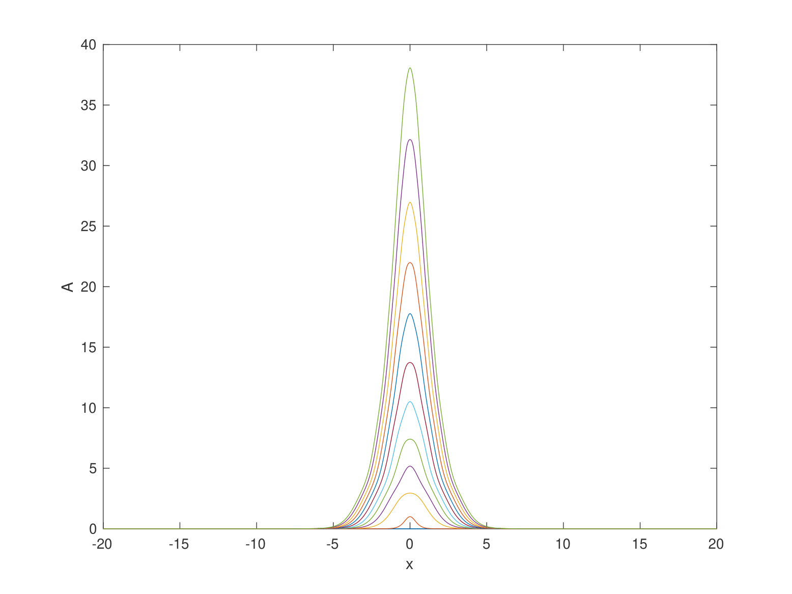
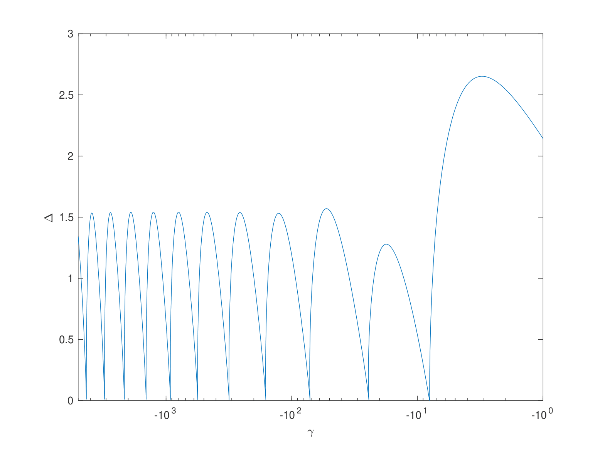

# One-dimensional Fourier Spectral Multigrid for the forced Korteweg de-Vries equation

Code written in Matlab. Archived and uploaded to GitHub.

## About:
Solves the one-dimensional forced Korteweg de-Vries equation (fKdV) using Fourier Spectral Multigrid.

A sech^2 bump forcing is used with a large (periodic) domain simulating decay at infinity.

Pseudo arc-length continuation is used to trace the hydraulic fall parameter space and evolution from exponentially decaying to algebraically decaying solitary waves. Shooting method is used to find solitary wave solutions.

## Results

### Solitary wave solutions from shooting method

### Hydraulic fall parametric space

